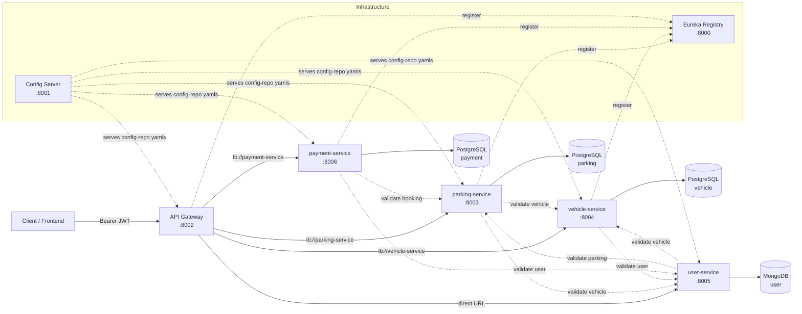
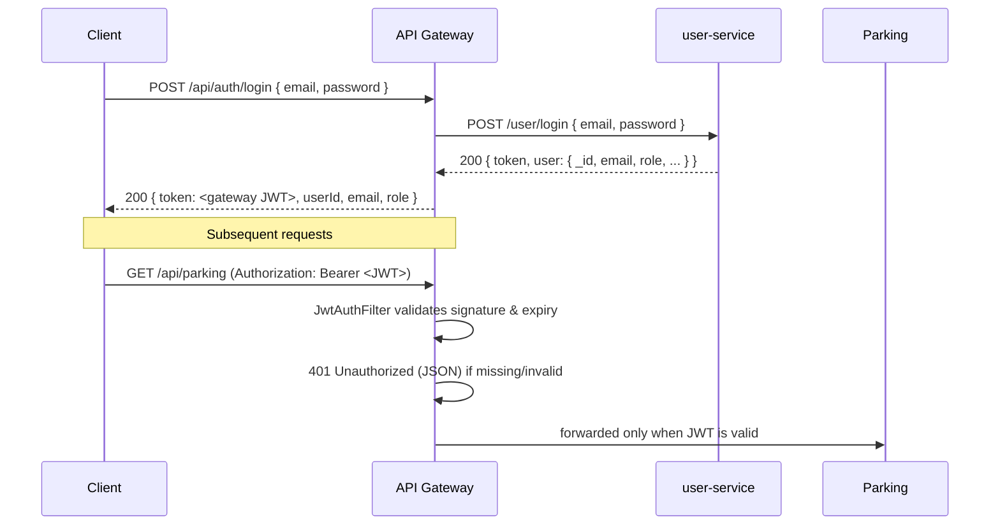

# Smart Parking Management System (SPMS)

A cloud-native, microservice-based application for real-time management and monitoring of parking spaces. Users can locate, reserve, and pay for parking; owners can monitor and manage their spaces dynamically.

## Table of Contents

- [Architecture](#architecture)
- [Authentication](#authentication)
- [Tech Stack](#tech-stack)
- [Services](#services)
  - [api-gateway](#api-gateway)
  - [parking-service](#parking-service)
  - [vehicle-service](#vehicle-service)
  - [user-service](#user-service)
  - [payment-service](#payment-service)
- [Infrastructure](#infrastructure)
- [Service-to-Service Communication](#service-to-service-communication)
- [Getting Started](#getting-started)
- [Project Structure](#project-structure)
- [Resources](#resources)

---

## Architecture

Microservice architecture. Every request enters through the **API Gateway** (`:8002`), which authenticates the caller with a JWT and then load-balances the call to the owning service. Each service is independently deployable, owns its own database, and exposes a JSON REST API behind a consistent `ApiResponse` envelope. Spring Cloud Eureka (`:8000`) is the service registry & discovery, so services locate each other by name (e.g. `lb://parking-service`) instead of hard-coded addresses. All configuration is centralized in a Spring Cloud Config Server (`:8001`) that serves the YAML files from the `config-repo` folder.



## Authentication

All routes behind the gateway (except `/api/auth/**`) require a valid JWT. The user-service (Node) is the source of truth for credentials (bcrypt-hashed passwords); the gateway is the token issuer (jjwt). The gateway forwards the login request to user-service to verify the credentials, then signs its **own** JWT that the client must send as `Authorization: Bearer <token>` on every subsequent call.



## Tech Stack

| Layer | Choice |
| --- | --- |
| Java services | Java 21, Spring Boot 4.1.0, Spring Data JPA (Hibernate 7), Bean Validation, ModelMapper, Spring Cloud Eureka Client |
| API Gateway | Spring Cloud Gateway (MVC), Spring Security, **jjwt** (API + impl + jackson) for JWT signing/validation, Spring Cloud LoadBalancer |
| Node service | Node.js, TypeScript, Express 5, Mongoose (MongoDB), Zod (validation), JWT + bcryptjs (auth) |
| Databases | PostgreSQL (parking-service, vehicle-service, payment-service), MongoDB (user-service) |
| Infrastructure | Eureka Registry, Spring Cloud Config Server (git backend), Docker |
| Communication | Service-to-service via **Spring WebFlux `WebClient`** in Java services and **axios** in the Node service |
| Tooling | Maven wrapper per Java service, `npm`/`tsx` for the Node service, Postman collections |

## Services

| Service | Stack | Port | Description |
| --- | --- | --- | --- |
| `infastructure/api-gateway` | Spring Cloud Gateway (MVC) | 8002 | Single entry point. JWT login (`/api/auth/login`), validates JWTs on every other route, load-balances to services via Eureka. |
| `services/parking-service` | Spring Boot + PostgreSQL | 8003 | Manages parking spaces: list, manage, reserve, release, update status, and filter by location/availability. |
| `services/vehicle-service` | Spring Boot + PostgreSQL | 8004 | Handles vehicle operations: register, update, retrieve vehicle details, link vehicles to users, and simulate entry/exit tracking. |
| `services/user-service` | Node.js (Express) + MongoDB | 8005 | Handles user operations: register/authenticate (JWT), view/update profiles, and access booking history/logs. |
| `services/payment-service` | Spring Boot + PostgreSQL | 8006 | Handles payment operations: create payments, validate mock card data, simulate transaction flow/status, generate digital receipts, and process refunds. |

All responses use a consistent envelope:

```json
{
  "statusCode": 201,
  "message": "Payment Created Successfully",
  "data": { }
}
```

---

### api-gateway

The single entry point of the whole system. It owns no data of its own — it authenticates callers and forwards traffic.

**Endpoints**

| Method | Path | Description |
| --- | --- | --- |
| POST | `/api/auth/login` | Public. Verifies `{ email, password }` against user-service and returns a gateway-issued JWT. |
| GET/POST/PUT/DELETE | `/api/parking/**` | Proxied to `parking-service` (load-balanced via Eureka). |
| GET/POST/PUT/DELETE | `/api/vehicle/**` | Proxied to `vehicle-service` (load-balanced via Eureka). |
| GET/POST/PUT/DELETE | `/api/payment/**` | Proxied to `payment-service` (load-balanced via Eureka). |
| GET/POST/PUT/DELETE | `/api/user/**` | Proxied to `user-service` (direct URL — Node service is not in Eureka). |

Every proxied route strips the `/api` prefix (`StripPrefix=1`), so `/api/parking/1` becomes `/parking/1` downstream.

**Notable behavior**

- **Authentication** (`POST /api/auth/login`): the gateway forwards the credentials to `user-service` (`POST /user/login`) via a `WebClient`; on success it signs its **own** JWT (jjwt) containing `subject = userId`, plus `email` and `role` claims, expiring after 24h (`jwt.expiration-ms`).
- **Authorization**: every request except `/api/auth/**` and `/actuator/**` must carry `Authorization: Bearer <JWT>`. The `JwtAuthFilter` validates signature + expiry and populates the Spring Security context. Missing/invalid tokens get a `401` JSON response.
- **Load balancing**: routes to Java services use `lb://<service-name>` URIs and are resolved through Eureka (Spring Cloud LoadBalancer makes round-robin between instances trivial to scale). The Node service is reached by direct URL `user-service.url`.

---

### parking-service

Responsible for parking spaces and reservations. A parking spot has a `city`, `zone`, `location`, `address`, coordinates (`lat`/`lng`), a `status` (`AVAILABLE` / `OCCUPIED`), and optionally a linked `vehicleId` once reserved.

**Endpoints**

| Method | Path | Description |
| --- | --- | --- |
| GET | `/parking` | Get all parking spots |
| GET | `/parking/available` | Get only available spots |
| GET | `/parking/location/{location}` | Search spots by location (case-insensitive) |
| GET | `/parking/vehicle/{vehicleId}` | Get the spot currently occupied by a given vehicle |
| GET | `/parking/{id}` | Get a spot by id |
| POST | `/parking` | Create a parking spot |
| PUT | `/parking/{id}` | Update a parking spot |
| POST | `/parking/{parkingId}/reserve/{vehicleId}` | Reserve a spot for a vehicle |
| POST | `/parking/{parkingId}/release` | Release an occupied spot |
| DELETE | `/parking/{id}` | Delete a parking spot |

**Notable business rules**

- Reservation flow (`reserveParking`): first **validates the `vehicleId` against vehicle-service** (`VehicleServiceClient` via `lb://vehicle-service`), then enforces that the vehicle is not already parked (`VehicleAlreadyReservedException`) and the spot is `AVAILABLE` (`ParkingNotAvailable`). The spot row is locked with a **pessimistic lock** (`findByIdForUpdate`) so two concurrent reservations cannot both succeed.
- Release flow (`releaseParking`): only `OCCUPIED` spots can be released; the vehicle link is cleared and status returns to `AVAILABLE`.
- If vehicle-service is unreachable the reservation fails with `503 Service Unavailable` — bookings never assume a vehicle exists.

---

### vehicle-service

Responsible for vehicle registration and lifecycle. A vehicle belongs to a `userId`, has a unique `vehicleNumber`, a `type`, and a `status` (`INSIDE` / `OUTSIDE`) used to simulate entry/exit tracking.

**Endpoints**

| Method | Path | Description |
| --- | --- | --- |
| GET | `/vehicle` | Get all vehicles |
| GET | `/vehicle/user/{userId}` | Get all vehicles belonging to a user |
| GET | `/vehicle/number/{vehicleNumber}` | Get a vehicle by its plate number |
| GET | `/vehicle/{id}` | Get a vehicle by id |
| POST | `/vehicle` | Register a vehicle |
| PUT | `/vehicle/{id}` | Update a vehicle |
| POST | `/vehicle/{id}/entry` | Simulate the vehicle entering the lot |
| POST | `/vehicle/{id}/exit` | Simulate the vehicle leaving the lot |
| DELETE | `/vehicle/{id}` | Delete a vehicle |

**Notable business rules**

- `vehicleNumber` must be unique (`VehicleNumberAlreadyExistsException`).
- When registering a vehicle with a `userId`, the service **validates that user exists** via user-service (`UserServiceClient`, direct URL `user-service.url`).
- Entry/exit are guarded: a vehicle already `INSIDE` cannot enter again (`VehicleAlreadyInsideException`), and a vehicle that is not inside cannot exit (`VehicleNotInsideException`).
- Exposes `GET /vehicle/{id}` — the endpoint other services call to validate a `vehicleId`.

---

### user-service

The only Node.js service. Handles users and their booking history using Express + MongoDB. Passwords are hashed with bcrypt and authentication is issued as a JWT.

**Endpoints**

| Method | Path | Description |
| --- | --- | --- |
| GET | `/user` | Get all users |
| GET | `/user/:id` | Get a user by id |
| POST | `/user/register` | Register a new user (returns JWT) |
| POST | `/user/login` | Authenticate (returns JWT) |
| PUT | `/user/:id` | Update profile |
| DELETE | `/user/:id` | Delete a user |
| GET | `/user/:id/bookings` | Get a user's booking history |
| POST | `/user/:id/bookings` | Add an entry to the booking history |

**Notable business rules**

- Input is validated with **Zod** schemas before reaching the service layer.
- `POST /user/:id/bookings` **validates the `parkingId` and `vehicleId` with parking-service and vehicle-service** (axios) before appending to the booking history — invalid references get `404`, unreachable services get `503`.
- Booking history is stored on the user document as a simple `{ parkingId, vehicleId, action, timestamp }` log.
- `POST /user/login` is the endpoint the API Gateway calls to verify credentials; the response includes the user's own (Node-issued) JWT plus the full user object.

---

### payment-service

Responsible for the mock payment flow. A payment references a `bookingId` and `userId`, holds an `amount`, a `paymentMethod`, the card's last 4 digits (full card is never stored), and a `status` (`PENDING` / `PAID` / `FAILED` / `REFUNDED`). Successful transactions get a digital `receiptNumber` (e.g. `RCP-8F8D4E5B`) and a `paidAt` timestamp.

**Endpoints**

| Method | Path | Description |
| --- | --- | --- |
| GET | `/payment` | Get all payments |
| GET | `/payment/booking/{bookingId}` | Get payments for a booking |
| GET | `/payment/user/{userId}` | Get payments made by a user |
| GET | `/payment/receipt/{id}` | Get the digital receipt for a payment |
| GET | `/payment/{id}` | Get a payment by id |
| POST | `/payment` | Create a payment with mock card details |
| PUT | `/payment/{id}` | Update amount/method/status |
| POST | `/payment/{id}/pay` | Process the transaction (simulate the gateway) |
| POST | `/payment/{id}/refund` | Refund a paid payment |
| DELETE | `/payment/{id}` | Delete a payment |

**Notable business rules**

- `POST /payment` first **validates the `bookingId` with parking-service** (`ParkingServiceClient` via `lb://parking-service`) and the **`userId` with user-service** (direct URL) — non-existent references are rejected with `404`.
- Card validation is mocked: the card number must pass the **Luhn algorithm** and the expiry must not be in the past.
- Only the **last 4 digits** of the card are persisted (e.g. `4242`); the card is never stored or returned.
- `POST /payment/{id}/pay` simulates a payment gateway: card ending in `0000` → `FAILED`, otherwise → `PAID` with a receipt number and `paidAt`.
- A `PAID` payment cannot be paid again (`PaymentAlreadyPaidException`); only `PAID` payments can be refunded (`PaymentNotRefundableException`); receipts are only available for processed payments (`PaymentNotProcessedException`).
- `pay`/`refund` lock the row with a pessimistic lock to prevent double-processing under concurrency.

---

## Infrastructure

| Module | Port | Description |
| --- | --- | --- |
| `infastructure/eureka-server` | 8000 | Service registry. Every Java service (and the gateway) registers here; `lb://` routes and clients resolve instances through it. |
| `infastructure/config-server` | 8001 | Serves configuration from the `config-repo` folder (git backend). Every service imports `optional:configserver:http://localhost:8001` and reads its `{service-name}.yaml` from here. |
| `config-repo` | - | YAML files per service: ports, `spring.datasource.url` (`${DB_URL}` from each service's `.env`), Eureka settings, and (for the gateway) routes + JWT settings. |

## Service-to-Service Communication

Every service now validates the cross-service references it consumes. Java services use **Spring WebFlux `WebClient`** (non-blocking, with a blocking call at the service boundary); the Node service uses **axios**. Calls to Java services go through **Eureka** (`lb://`), calls to the Node service use a **direct URL** because it is not registered with Eureka.

| Caller | Callee | Call | Failure behavior |
| --- | --- | --- | --- |
| `parking-service` | `vehicle-service` | Validate `vehicleId` on reserve | `404 Vehicle not found` / `503` if unreachable |
| `vehicle-service` | `user-service` | Validate `userId` on register | `404 User not found` / `503` if unreachable |
| `payment-service` | `parking-service` | Validate `bookingId` on payment create | `404 Booking not found` / `503` if unreachable |
| `payment-service` | `user-service` | Validate `userId` on payment create | `404 User not found` / `503` if unreachable |
| `user-service` | `parking-service` / `vehicle-service` | Validate `parkingId`/`vehicleId` on booking log | `404` / `503` if unreachable |
| `api-gateway` | `user-service` | Verify credentials on login | `401 Invalid email or password` / `503` if unreachable |

---

## Getting Started

### Prerequisites

- JDK 21+
- Node.js 18+
- PostgreSQL and MongoDB (or hosted equivalents, e.g. Neon / Atlas)
- Docker (optional, for containers)

### Configure & run

Start the infrastructure first, then the gateway, then the services.

Each service reads a `.env` file (values are imported via `spring.config.import: optional:file:.env[.properties]` in Java services, and `dotenv` in the Node service). Create a `.env` in each service folder with at least the database URL:

```bash
# e.g. services/parking-service/.env
DB_URL=jdbc:postgresql://localhost:5432/parking_db
```

```bash
# 1. Infrastructure (each from its own directory)
cd infastructure/eureka-server && ./mvnw spring-boot:run     # :8000
cd infastructure/config-server && ./mvnw spring-boot:run     # :8001
cd infastructure/api-gateway  && ./mvnw spring-boot:run      # :8002

# 2. Services
cd services/parking-service  && ./mvnw spring-boot:run       # :8003
cd services/vehicle-service  && ./mvnw spring-boot:run       # :8004
cd services/payment-service  && ./mvnw spring-boot:run       # :8006

# 3. Node service
cd services/user-service && npm install && npm run dev       # :8005
```

### Authentication flow (quick test)

```bash
# 1. Get a token
curl -X POST http://localhost:8002/api/auth/login \
  -H "Content-Type: application/json" \
  -d '{"email":"user@example.com","password":"secret"}'

# 2. Call a protected route with the token
curl http://localhost:8002/api/parking \
  -H "Authorization: Bearer <token>"
```

## Project Structure

```
├── config-repo/                  # YAML configuration per service (served by config-server)
├── infastructure/
│   ├── api-gateway/              # Spring Cloud Gateway (MVC), JWT auth, :8002
│   ├── config-server/            # centralized configuration server, :8001
│   └── eureka-server/            # service registry, :8000
├── docs/                         # coursework PDF, screenshots
├── postman/
│   └── services/                 # Postman collections per service
└── services/
    ├── parking-service/          # Spring Boot, PostgreSQL, :8003
    ├── vehicle-service/          # Spring Boot, PostgreSQL, :8004
    ├── user-service/             # Node.js/Express + MongoDB, :8005
    └── payment-service/          # Spring Boot, PostgreSQL, :8006
```

## Resources

- [Parking Service Postman Collection](./postman/services/parking-service.postman_collection.json)
- [Vehicle Service Postman Collection](./postman/services/vehicle-service.postman_collection.json)
- [User Service Postman Collection](./postman/services/user-service.postman_collection.json)
- [Payment Service Postman Collection](./postman/services/payment-service.postman_collection.json)
- 