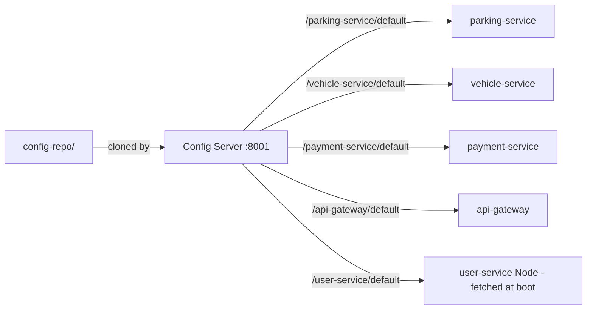

# config-repo

The **single source of configuration** for the whole system. These YAML files are served by the config server (`infastructure/config-server`, `:8001`) to every service — no service keeps its settings in its own repo copy anymore; changing a YAML here (and pushing to the remote repo's `main` branch) reconfigures the running system.

## How it is served

- Java services import it via `optional:configserver:http://localhost:8001` in their local `application.yaml`.
- The Node user-service fetches `/user-service/default` once at boot (`src/config/remoteConfig.ts`).
- The config server backend is git: `uri: https://github.com/yasasbanukaofficial/kadolk-backend-microservice`, `search-paths: config-repo`, `default-label: main` — so this folder must be pushed to the remote `main` for remote config to flow. Locally, the config server can be started with the `native` profile pointing at this folder (see `infastructure/config-server/README.md`).

## The files

| File | What it configures |
| --- | --- |
| `eureka-server.yaml` | registry: port `8000`, `register-with-eureka: false`, `fetch-registry: false` |
| `api-gateway.yaml` | port `8002`, the 4 gateway routes (`lb://` for Java services, direct URL for user), `jwt.secret` + `jwt.expiration-ms`, `user-service.url`, eureka client |
| `parking-service.yaml` | port `8003`, datasource `${DB_URL}`, JPA dialect, eureka client with default zone |
| `vehicle-service.yaml` | port `8004`, datasource `${DB_URL}`, `user-service.url`, `eureka.client.enabled: true` |
| `payment-service.yaml` | port `8006`, datasource `${DB_URL}`, `user-service.url`, `eureka.client.enabled: true` |
| `user-service.yaml` | Node env keys: `PORT`, `MONGO_URI`, `PARKING_SERVICE_URL`, `VEHICLE_SERVICE_URL` |

## Conventions

- **Never put secrets in these files.** Use placeholders: `spring.datasource.url: ${DB_URL}` — each service supplies the real value via its local `.env` (Java) or environment (Node). The optional `.env` import means a missing env var fails only where it is used, not at boot.
- **`${VAR}` placeholders** are resolved by the consuming service, not by the config server.
- **Adding a new service?** Create `{service-name}.yaml` here, and give the service a local `application.yaml` that imports `optional:configserver:http://localhost:8001`.
- Pushing to `config-repo` on the remote `main` **is** the deployment of configuration.