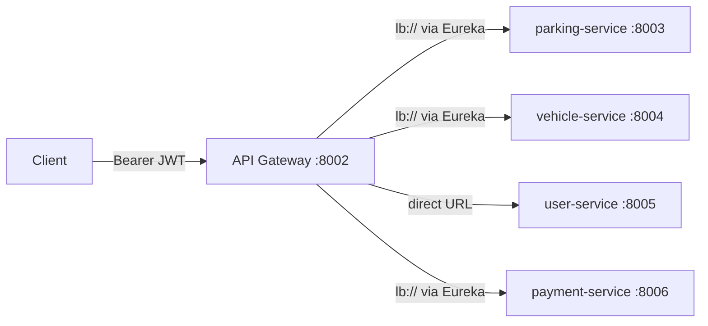

# api-gateway

The **single entry point** of the Smart Parking Management System. It authenticates callers and forwards all traffic to the backend services. It owns no data of its own — there is no entity, no repository and no database.

## Role in the system



Every request in the whole system passes through this service. It is built with **Spring Cloud Gateway (MVC variant)** — the servlet-based flavour of Spring Cloud Gateway — so it uses classic Spring MVC + Spring Security code (no reactive code), which keeps it consistent with the rest of the Java services in the repo.

## Tech stack

| Layer | Choice | Why |
| --- | --- | --- |
| Framework | Spring Cloud Gateway (`spring-cloud-starter-gateway-server-webmvc`) | Routing + filters without writing a proxy from scratch |
| Security | Spring Security (`spring-boot-starter-security`) | Standard servlet `SecurityFilterChain`, stateless JWT authentication |
| JWT | `jjwt-api` + `jjwt-impl` + `jjwt-jackson` (0.12.6) | Sign and validate HMAC-SHA256 JWTs; jackson module serializes the claims |
| HTTP client | Spring WebFlux `WebClient` (only for outbound calls) | Same client every other Java service uses to talk to the Node user-service |
| Discovery | Spring Cloud Eureka client + LoadBalancer | Resolves `lb://service-name` route targets to real instances |
| Config | Spring Cloud Config client | Imports settings from the config server (`config-repo/api-gateway.yaml`) |

## Project structure

```
infastructure/api-gateway/
├── Dockerfile                      # multi-stage: maven:latest build → eclipse-temurin:latest runtime
├── .dockerignore                   # excludes target/, .env, .git, mvnw from the image context
├── pom.xml
├── mvnw / mvnw.cmd / .mvn/         # Maven wrapper (no local Maven install needed)
└── src/main/
    ├── java/com/spms/apigateway/
    │   ├── ApiGatewayApplication.java   # boot class, @EnableDiscoveryClient (registers with Eureka)
    │   ├── client/
    │   │   └── UserServiceClient.java   # calls user-service /user/login to verify credentials
    │   ├── config/
    │   │   ├── SecurityConfig.java      # stateless security chain + JSON 401 entry point
    │   │   └── WebClientConfig.java     # plain (non-load-balanced) WebClient bean
    │   ├── controller/
    │   │   └── AuthController.java      # POST /api/auth/login
    │   ├── dto/
    │   │   ├── req/LoginReq.java        # { email, password } with validation
    │   │   └── res/LoginRes.java        # { token, userId, name, email, role }
    │   ├── exceptions/
    │   │   ├── GlobalExceptionHandler.java      # central @RestControllerAdvice
    │   │   ├── InvalidCredentialsException.java # → 401
    │   │   └── ServiceUnavailableException.java # → 503
    │   ├── security/
    │   │   ├── JwtAuthFilter.java       # OncePerRequestFilter: validates Bearer token, fills SecurityContext
    │   │   └── JwtService.java          # jjwt signing / parsing / validation
    │   ├── service/
    │   │   └── AuthService.java         # orchestrates login: user-service check → sign JWT
    │   └── util/
    │       └── ApiResponse.java         # { statusCode, message, data } envelope used by every service
    └── resources/
        └── application.yaml             # app name + config server import (settings live in config-repo)
```

### Class-by-class explanation

**`ApiGatewayApplication`** — the boot class. `@SpringBootApplication` + `@EnableDiscoveryClient`, the same pair every Java service uses so the gateway registers itself with Eureka on `:8000`.

**`security/JwtService`** — the JWT engine (jjwt 0.12):

- `generateToken(userId, email, role)` — builds a token with `subject = userId` (which is the Mongo `_id` string from user-service), `email` and `role` claims, issued now, expiring after `jwt.expiration-ms` (24h by default), signed HMAC-SHA256 with `jwt.secret`.
- `parse(token)` — verifies the signature and returns the claims.
- `isValid(token)` — `parse` wrapped in a try/catch; any exception (bad signature, tampering, expiry) → `false`.

**`security/JwtAuthFilter`** — a servlet `OncePerRequestFilter` registered *before* the username/password filter in the chain:

- `shouldNotFilter` skips `/api/auth/**` and `/actuator/**` (no token needed there).
- For every other request it reads `Authorization: Bearer <token>`; if the token validates, it puts a `UsernamePasswordAuthenticationToken` (principal = userId, authority `ROLE_<role>`) into the `SecurityContextHolder`.
- If the header is missing or the token is invalid, it does nothing — the request just has no authentication, and Spring Security rejects it with `401` (see `SecurityConfig`).

**`config/SecurityConfig`** — the security chain:

- CSRF, form login and HTTP basic disabled; sessions are **stateless** (there is no server-side session — every request must come with a JWT).
- `requestMatchers("/api/auth/**").permitAll()` and `/actuator/**` open; **everything else requires authentication** (`anyRequest().authenticated()`).
- Custom `authenticationEntryPoint` writes a JSON `ApiResponse` with `401 Unauthorized - missing or invalid JWT token` instead of the default HTML page.

**`config/WebClientConfig`** — exposes a plain `WebClient` bean. Note it is **not** `@LoadBalanced` here: the only call the gateway makes is to user-service by direct URL, since the Node service is not registered with Eureka.

**`client/UserServiceClient`** — how the gateway verifies credentials:

- POSTs `{ email, password }` to `${user-service.url}/user/login` (default `http://localhost:8005`).
- `401` from user-service → `InvalidCredentialsException` ("Invalid email or password").
- Any other error status → `ServiceUnavailableException`.
- A connection failure (user-service down) → `ServiceUnavailableException` ("User service is currently unavailable").
- On success parses the user-service payload `data.user` — note the Mongo id arrives under the key `_id`, so the DTO maps it with `@JsonProperty("_id")`. The user-service's own Node JWT (`data.token`) is deliberately ignored: the gateway issues **its own** token.
- Everything is wrapped in a try/catch so the API always gets a clean `503` instead of a raw `WebClient` exception.

**`service/AuthService`** — the login orchestration: ask `UserServiceClient` for the user, then sign the gateway JWT with `JwtService`, and return `LoginRes { token, userId, name, email, role }`.

**`controller/AuthController`** — the only controller. `POST /api/auth/login` validates the body with Bean Validation (`LoginReq`), delegates to `AuthService`, wraps in the `ApiResponse` envelope.

**`exceptions/`** — `InvalidCredentialsException` → `401`, `ServiceUnavailableException` → `503`, validation errors → `400`, anything uncaught → `500` with the standard "An unexpected error occurred" message. All responses keep the `{ statusCode, message, data }` envelope.

## Routing (load balancing)

Routes are defined in `config-repo/api-gateway.yaml` (served by the config server), not in code — the gateway loads them like any other property:

| Route id | Predicate | Target | Filter |
| --- | --- | --- | --- |
| `parking-service` | `Path=/api/parking/**` | `lb://parking-service` | `StripPrefix=1` |
| `vehicle-service` | `Path=/api/vehicle/**` | `lb://vehicle-service` | `StripPrefix=1` |
| `payment-service` | `Path=/api/payment/**` | `lb://payment-service` | `StripPrefix=1` |
| `user-service` | `Path=/api/user/**` | `${user-service.url:http://localhost:8005}` | `StripPrefix=1` |

- **`lb://` URIs + LoadBalancer** = the load balancing bit. Spring Cloud LoadBalancer asks Eureka for the instances of e.g. `parking-service` and picks one. If you scale parking-service to 3 instances, the gateway balances across them automatically (round-robin).
- **`StripPrefix=1`** removes the first path segment, so `/api/parking/5` is forwarded as `/parking/5` to the downstream service.
- user-service is reached by **direct URL** because the Node service never registers with Eureka.

## Configuration

Everything configurable lives in `config-repo/api-gateway.yaml`:

| Key | Purpose |
| --- | --- |
| `server.port` | 8002 |
| `spring.cloud.gateway.routes` | the route table above |
| `jwt.secret` | HMAC key for signing/validation, overridable via `.env` `JWT_SECRET` |
| `jwt.expiration-ms` | token lifetime (86400000 = 24h) |
| `user-service.url` | where to reach the Node service |
| `eureka.client.*` | registration with Eureka on `:8000` |
| `management.endpoints.web.exposure.include` | actuator health/metrics/prometheus for monitoring |

Local `application.yaml` only sets the app name and imports `optional:configserver:http://localhost:8001` — if no config server is running the gateway still boots with defaults.

## How to run

```bash
cd infastructure/api-gateway
./mvnw spring-boot:run
```

Requires (in order of dependency): config server (`:8001`) → eureka (`:8000`) → gateway → services. Without Eureka the `lb://` routes have nowhere to resolve — the gateway still starts, but proxied calls fall over.

Test the auth flow:

```bash
# login (public)
curl -X POST http://localhost:8002/api/auth/login \
  -H "Content-Type: application/json" \
  -d '{"email":"user@example.com","password":"secret"}'

# protected call (401 without a token)
curl http://localhost:8002/api/parking

# protected call (200 with a token)
curl http://localhost:8002/api/parking -H "Authorization: Bearer <token>"
```

## Docker

```bash
docker build -t spms/api-gateway .
docker run -p 8002:8002 spms/api-gateway
```

Multi-stage build (`maven:latest` → `eclipse-temurin:latest`), identical pattern to every other Java service. The `.env` is excluded from the image, so supply `JWT_SECRET` etc. via environment variables at runtime.