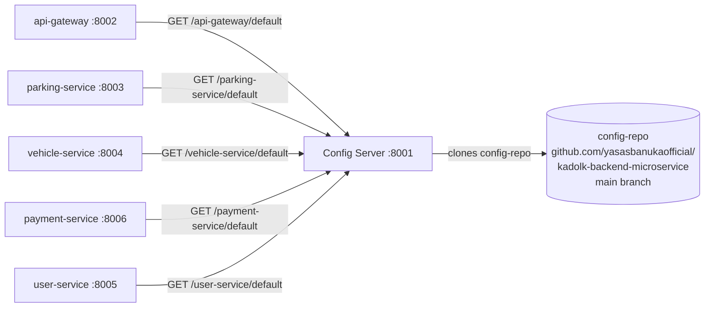

# config-server

The **centralized configuration service** (Spring Cloud Config). It serves every service its settings as YAML files from the **`config-repo`** folder, which here is backed by a **git repository** — the config server clones the repo, follows `main`, and serves `{service-name}.yaml` on demand.

## Role in the system



Every service imports `optional:configserver:http://localhost:8001` — *optional*, so a service still boots (with defaults) when the config server is down.

## Project structure

```
infastructure/config-server/
├── Dockerfile / .dockerignore
├── pom.xml / mvnw / .mvn/
└── src/main/
    ├── java/com/spms/configserver/
    │   └── ConfigServerApplication.java   # @EnableConfigServer
    └── resources/
        └── application.yaml               # git backend + port
```

### Class-by-class explanation

**`ConfigServerApplication`** — `@EnableConfigServer` activates the Spring Cloud Config server endpoints. That single annotation is the whole "server" — everything else is configuration.

## Configuration (`application.yaml`)

```yaml
spring:
  application:
    name: config-server
  profiles:
    active: git                  # switch to the git backend
  cloud:
    config:
      server:
        git:
          uri: https://github.com/yasasbanukaofficial/kadolk-backend-microservice
          search-paths: config-repo     # configs live in the config-repo/ folder of the repo
          default-label: main           # always serve the main branch
server:
  port: 8001
```

How a request flows: the gateway asks `GET /api-gateway/default` → the server clones/refreshes the git repo → finds `config-repo/api-gateway.yaml` → returns it as JSON properties. This means **configuration changes are deployed by pushing to the repo's `main` branch** and the config server picks them up (clients refresh on boot or via actuator refresh).

## What lives in config-repo (`/config-repo` of the repo root)

| File | Serves |
| --- | --- |
| `eureka-server.yaml` | registry-port 8000, standalone flags, actuator exposure |
| `api-gateway.yaml` | port 8002, all gateway routes, `jwt.secret` / `jwt.expiration-ms`, `user-service.url`, eureka client |
| `parking-service.yaml` | port 8003, `spring.datasource.url: ${DB_URL}`, JPA dialect, eureka client |
| `vehicle-service.yaml` | port 8004, datasource, `user-service.url`, eureka client enabled |
| `payment-service.yaml` | port 8006, datasource, `user-service.url`, eureka client enabled |
| `user-service.yaml` | `PORT`, `MONGO_URI`, `PARKING_SERVICE_URL`, `VEHICLE_SERVICE_URL` (fetched by the Node service at boot) |

Secrets (`DB_URL`, `MONGO_URI`, `JWT_SECRET`) are never written in the repo — the YAMLs placehold them as `${VAR}` and each service supplies the actual value from its local `.env` or environment.

## How to run

```bash
cd infastructure/config-server
./mvnw spring-boot:run        # :8001
```

Verify it works (needs the config-repo pushed to the remote `main`):

```bash
curl http://localhost:8001/parking-service/default
```

Docker: `docker build -t spms/config-server . && docker run -p 8001:8001 spms/config-server`.

### Local development without the remote repo

To serve configs straight from the local `config-repo/` folder instead of git (useful before pushing anything):

```bash
./mvnw spring-boot:run \
  -Dspring-boot.run.arguments="--spring.profiles.active=native --spring.cloud.config.server.native.search-locations=file:/absolute/path/to/config-repo"
```