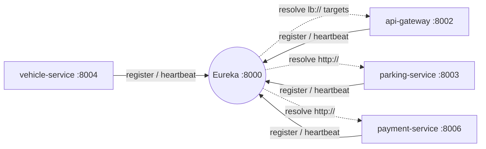

# eureka-server

The **service registry** of the system (Netflix Eureka). Every Java service — and the API Gateway — registers itself here on startup, and Spring Cloud LoadBalancer consults this registry to resolve `lb://<service-name>` URIs to real host:port instances.

## Role in the system



Nothing calls `lb://x` or `http://parking-service/...` without this registry: it maps service names to live instances (with a built-in health check via heartbeats — dead instances are evicted automatically).

## Project structure

```
infastructure/eureka-server/
├── Dockerfile / .dockerignore
├── pom.xml / mvnw / .mvn/
└── src/main/
    ├── java/com/spms/eurekaserver/
    │   └── EurekaServerApplication.java   # @EnableEurekaServer
    └── resources/
        └── application.yaml               # app name + config server import
```

### Class-by-class explanation

**`EurekaServerApplication`** — `@EnableEurekaServer` turns the plain Spring Boot app into the registry. Spring Boot 4 + Spring Cloud 2025.1.2, Java 21. The generated test class is a standard context-load test.

## Configuration

The local `application.yaml` only names the app and imports `optional:configserver:http://localhost:8001` — the actual registry settings live in `config-repo/eureka-server.yaml`:

```yaml
server.port: 8000

eureka.client.register-with-eureka: false   # the registry must NOT register itself
eureka.client.fetch-registry: false         # the registry already IS the registry
```

Why the two `false` flags? A Eureka server has nothing to discover — it *is* the discovery service. Registering with itself or fetching its own registry would just add noise and a second instance of EUREKA-SERVER in the dashboard.

## How to run

```bash
cd infastructure/eureka-server
./mvnw spring-boot:run        # :8000
```

Open `http://localhost:8000` for the dashboard — you should see `PARKING-SERVICE`, `VEHICLE-SERVICE`, `PAYMENT-SERVICE` and `API-GATEWAY` registered once the whole stack is up. Docker: `docker build -t spms/eureka-server . && docker run -p 8000:8000 spms/eureka-server`.