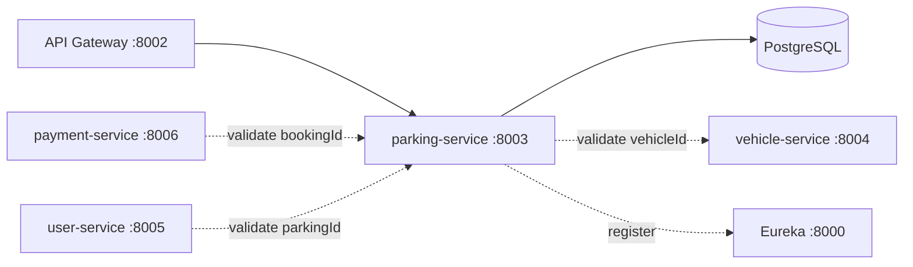

# parking-service

Owns the **parking spaces** of the system: who owns a spot, where it is, whether it is free, and which vehicle is parked in it. It also drives the reservation and release workflow.

## Role in the system



- Receives its traffic via the gateway (`/api/parking/**` → `/parking/**`).
- **Consumes** vehicle-service to validate that a `vehicleId` really exists before reserving.
- **Is consumed by** payment-service (a payment's `bookingId` is a parking id) and user-service (booking history logs reference parking ids).

## Tech stack

Java 21 · Spring Boot 4.1.0 · Spring Data JPA (Hibernate 7, PostgreSQL) · Bean Validation · ModelMapper · Spring WebFlux WebClient (for the vehicle-service call) · Spring Cloud (config client, Eureka client, LoadBalancer)

## Project structure

```
services/parking-service/
├── Dockerfile                       # maven:latest build → eclipse-temurin:latest runtime
├── .dockerignore                    # excludes target/, .env, .git, mvnw
├── pom.xml
├── mvnw / mvnw.cmd / .mvn/          # Maven wrapper
├── .env                             # local secrets: DB_URL (git-ignored)
└── src/main/
    ├── java/com/spms/parkingservice/
    │   ├── ParkingServiceApplication.java   # boot class, @EnableDiscoveryClient
    │   ├── client/
    │   │   └── VehicleServiceClient.java    # validates a vehicleId via lb://vehicle-service
    │   ├── config/
    │   │   ├── AppConfig.java               # ModelMapper bean
    │   │   └── WebClientConfig.java         # @LoadBalanced WebClient.Builder bean
    │   ├── controller/
    │   │   └── ParkingController.java       # REST endpoints, maps to service
    │   ├── dto/
    │   │   ├── req/ParkingSaveReq.java      # create body + validation
    │   │   ├── req/ParkingUpdateReq.java    # update body + validation
    │   │   └── res/Parking{Summary,Detail,Reservation}Res.java  # response shapes
    │   ├── entity/
    │   │   └── Parking.java                 # JPA entity, @Version optimistic lock
    │   ├── exceptions/                      # domain errors + GlobalExceptionHandler
    │   ├── repo/
    │   │   └── ParkingRepo.java             # Spring Data JPA repository
    │   ├── service/
    │   │   ├── ParkingService.java          # interface
    │   │   └── impl/ParkingServiceImpl.java # business logic
    │   └── util/
    │       └── ApiResponse.java             # { statusCode, message, data } envelope
    └── resources/
        └── application.yaml                 # app name + config server import
```

### The entity (`entity/Parking.java`)

| Field | Type | Notes |
| --- | --- | --- |
| `id` | `Long` | identity-generated primary key |
| `version` | `Long` | `@Version` — Hibernate optimistic locking, bumped on every update |
| `ownerId` | `Long` | id of the owner (currently informational — ownership checks are future work) |
| `vehicleId` | `Long` | set when a spot is reserved; `null` when `AVAILABLE` |
| `city`, `zone`, `location`, `address` | `String` | `@Column(nullable = false)` |
| `lat`, `lng` | `String` | coordinates as strings (validated by regex in the DTO) |
| `status` | `ParkingStatus` enum | `AVAILABLE` / `OCCUPIED`, stored as STRING |
| `createdAt`, `updatedAt` | `LocalDateTime` | maintained by `@PrePersist` / `@PostPersist` / `@PreUpdate` callbacks |

Lifecycle hooks: on insert `defaultValues()` stamps timestamps and forces `status = AVAILABLE` — a new parking spot is always free and any client-supplied status is ignored.

### The repository (`repo/ParkingRepo.java`)

```java
Optional<Parking> findByIdForUpdate(Long id);           // SELECT ... FOR UPDATE (pessimistic lock)
List<Parking> getAllByStatus(ParkingStatus status);
List<Parking> getAllByLocationContainingIgnoreCase(String location);
Optional<Parking> getParkingByVehicleId(Long vehicleId);
```

`findByIdForUpdate` is the concurrency safeguard: `reserveParking` / `releaseParking` run inside `@Transactional`, so the locked row cannot be reserved twice concurrently.

### The service (`service/impl/ParkingServiceImpl.java`) — the interesting logic

**`save`** — ModelMapper copies the request DTO into a new `Parking` entity and persists it. The `@PrePersist` hook takes care of status/timestamps.

**`reserveParking(vehicleId, parkingId)`** — the money flow, in order:

1. `vehicleServiceClient.validateVehicleExists(vehicleId)` — calls vehicle-service (`lb://vehicle-service/vehicle/{id}`). Vehicle missing → `404 Vehicle not found`; vehicle-service unreachable → `503`.
2. `existsByVehicleId` — the vehicle must not already occupy another spot (`VehicleAlreadyReservedException` → 409).
3. `findByIdForUpdate(parkingId)` — if no such spot → `ParkingNotFoundException` (404); the row is **pessimistically locked** here.
4. The spot must be `AVAILABLE`, otherwise `ParkingNotAvailable` (409).
5. Link the vehicle and flip the status to `OCCUPIED`.

**`releaseParking(parkingId)`** — same locking; only `OCCUPIED` spots can be released (`ParkingNotAvailable` otherwise), then `vehicleId` is cleared and status returns to `AVAILABLE`.

### The client (`client/VehicleServiceClient.java`)

Uses the `@LoadBalanced WebClient.Builder` — the URI is `http://vehicle-service/vehicle/{id}` with the *service name* as the host, which LoadBalancer resolves through Eureka to a real instance (that is the load balancing part).

- `404` → `VehicleNotFoundException`
- any other error status → `ServiceUnavailableException`
- connection failure / timeout → `ServiceUnavailableException`

The `onStatus` + catch pattern means the reservation flow always fails loudly and nicely — never with a raw client exception.

### Error responses (`exceptions/`)

| Exception → HTTP | When |
| --- | --- |
| `ParkingNotFoundException` → 404 | spot id does not exist |
| `VehicleNotFoundException` → 404 | vehicle-service reported the vehicle is unknown |
| `ParkingNotAvailable` → 409 | spot is not `AVAILABLE` (reserve) / not `OCCUPIED` (release) |
| `VehicleAlreadyReservedException` → 409 | vehicle already parked somewhere |
| `ServiceUnavailableException` → 503 | vehicle-service down or misbehaving |
| Bean Validation → 400 | payload rules violated (message lists every field error) |
| lock conflicts → 409 | `@Version` optimistic lock retry message |

## Endpoints

All under `/parking`, wrapped in the `ApiResponse` envelope:

| Method | Path | Description |
| --- | --- | --- |
| GET | `/parking` | all spots |
| GET | `/parking/available` | only `AVAILABLE` spots |
| GET | `/parking/location/{location}` | case-insensitive search |
| GET | `/parking/vehicle/{vehicleId}` | the spot a vehicle currently occupies |
| GET | `/parking/{id}` | one spot |
| POST | `/parking` | create (status forced to `AVAILABLE`) |
| PUT | `/parking/{id}` | update fields + status |
| POST | `/parking/{parkingId}/reserve/{vehicleId}` | reserve for a vehicle |
| POST | `/parking/{parkingId}/release` | release the spot |
| DELETE | `/parking/{id}` | delete |

## Configuration

Everything except the database URL comes from `config-repo/parking-service.yaml` (via the config server):

```yaml
server.port: 8003
spring.datasource.url: ${DB_URL}        # secret, from local .env
eureka.client.service-url.defaultZone: http://localhost:8000/eureka/
```

Local `application.yaml` only names the app and imports the config server (`optional:configserver:http://localhost:8001`) + the local `.env` (`optional:file:.env[.properties]`). Without `.env` the app boots but cannot connect to the database.

## How to run

```bash
cd services/parking-service
# create .env with: DB_URL=jdbc:postgresql://...
./mvnw spring-boot:run        # :8003
```

Dependencies at runtime: eureka (`:8000`), config server (`:8001`), and **vehicle-service (`:8004`)** for reservations. Docker: `docker build -t spms/parking-service . && docker run -p 8003:8003 spms/parking-service`.

## Postman

`postman/services/parking-service.postman_collection.json` at the repo root covers every endpoint, including the reserve/release flows and the validation error paths.