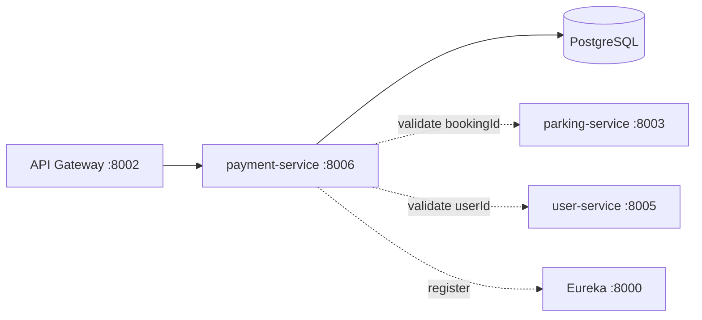

# payment-service

Owns the **mock payment flow**: creating payments for a booking, validating (mock) card data, simulating the payment gateway transaction, issuing digital receipts and processing refunds. Card numbers are never stored — only the last 4 digits.

## Role in the system



- Receives its traffic via the gateway (`/api/payment/**` → `/payment/**`).
- **Consumes** parking-service (a payment's `bookingId` is really a parking-spot id — must exist) and user-service (the paying user must exist).

## Tech stack

Java 21 · Spring Boot 4.1.0 · Spring Data JPA (Hibernate 7, PostgreSQL) · Bean Validation · ModelMapper · Spring WebFlux WebClient (for the inter-service calls) · Spring Cloud (config client, Eureka client, LoadBalancer)

## Project structure

```
services/payment-service/
├── Dockerfile / .dockerignore
├── pom.xml / mvnw / .mvn/
├── .env                            # local secrets: DB_URL
└── src/main/
    ├── java/com/spms/paymentservice/
    │   ├── PaymentServiceApplication.java    # boot class, @EnableDiscoveryClient
    │   ├── client/
    │   │   ├── ParkingServiceClient.java     # validates bookingId via lb://parking-service
    │   │   └── UserServiceClient.java        # validates userId via direct URL to user-service
    │   ├── config/
    │   │   ├── AppConfig.java                # ModelMapper bean
    │   │   └── WebClientConfig.java          # @LoadBalanced WebClient.Builder bean
    │   ├── controller/
    │   │   └── PaymentController.java
    │   ├── dto/
    │   │   ├── req/PaymentSaveReq.java       # create body + card data + validation
    │   │   ├── req/PaymentUpdateReq.java     # update body
    │   │   └── res/Payment{Summary,Detail,Receipt}Res.java
    │   ├── entity/
    │   │   ├── Payment.java                  # JPA entity, @Version optimistic lock
    │   │   ├── PaymentMethod.java            # CARD (only method today)
    │   │   └── PaymentStatus.java            # PENDING / PAID / FAILED / REFUNDED
    │   ├── exceptions/                       # domain errors + GlobalExceptionHandler
    │   ├── repo/
    │   │   └── PaymentRepo.java
    │   ├── service/
    │   │   ├── PaymentService.java           # interface
    │   │   └── impl/PaymentServiceImpl.java  # business logic
    │   └── util/
    │       └── ApiResponse.java
    └── resources/
        └── application.yaml                  # app name + config server import
```

### The entity (`entity/Payment.java`)

| Field | Type | Notes |
| --- | --- | --- |
| `id` | `Long` | identity-generated primary key |
| `version` | `Long` | `@Version` optimistic lock |
| `bookingId` | `Long` | the parking-spot id the payment is for — validated against parking-service |
| `userId` | `Long` | the paying user — validated against user-service |
| `amount` | `BigDecimal` | `precision = 10, scale = 2` |
| `paymentMethod` | `PaymentMethod` enum | `CARD` |
| `cardLast4` | `String` (length 4) | **only** this is persisted — never the full card |
| `status` | `PaymentStatus` enum | `PENDING` / `PAID` / `FAILED` / `REFUNDED` |
| `receiptNumber` | `String` | unique, e.g. `RCP-8F8D4E5B` — set when processed |
| `paidAt` | `LocalDateTime` | set when the fake gateway succeeds |
| `createdAt`, `updatedAt` | `LocalDateTime` | `@PrePersist` etc. — new payments are `PENDING` |

### The repository (`repo/PaymentRepo.java`)

```java
List<Payment> getAllByBookingId(Long bookingId);
List<Payment> getAllByUserId(Long userId);
Optional<Payment> findByIdForUpdate(Long id);        // SELECT ... FOR UPDATE
```

### The service (`service/impl/PaymentServiceImpl.java`) — the interesting logic

**`save`** — three validations, in order, before anything is persisted:

1. `parkingServiceClient.validateBookingExists(bookingId)` → `lb://parking-service/parking/{id}`; unknown booking → `404 Booking not found`, parking-service down → `503`.
2. `userServiceClient.validateUserExists(userId)` → direct URL to user-service; unknown user → `404 User not found`, down → `503`.
3. `validateMockCard(req)` — **Luhn check** on the card number and the expiry must not be in the past (`InvalidCardException` → 400).

The entity is then built field by field (deliberately *not* via ModelMapper, so the card is handled explicitly): only `substring(length - 4)` of the card number lands in `cardLast4`. Status defaults to `PENDING`.

**`pay(id)`** — simulates the real payment gateway:

1. `findByIdForUpdate` inside `@Transactional` (pessimistic lock — no double payments).
2. Already `PAID` → `PaymentAlreadyPaidException` (409); `REFUNDED` → not payable (`PaymentNotRefundableException`, 409).
3. `simulateGateway(payment)`: card ending **`0000` → `FAILED`** (test card for failures); anything else → `PAID` + `paidAt` + a fresh `RCP-XXXXXXXX` receipt number.
4. Returns the receipt DTO.

**`refund(id)`** — only a `PAID` payment can be refunded (`PaymentNotRefundableException` → 409); flips status to `REFUNDED` under the same pessimistic lock.

**`getReceipt(id)`** — receipts only exist for processed payments; a `PENDING` payment throws `PaymentNotProcessedException` (409).

Supporting bits worth knowing: `isLuhnValid` walks the digits right-to-left doubling every second one; `isExpiryValid` parses `MM/YY` into a `YearMonth` and compares with now; `generateReceiptNumber` = `RCP-` + 8 random uppercase hex chars.

### The clients (`client/`)

- `ParkingServiceClient` — the `@LoadBalanced` one: `http://parking-service/parking/{id}` resolves through Eureka. `404 → BookingNotFoundException`, other errors / connection failures → `ServiceUnavailableException`.
- `UserServiceClient` — plain `WebClient` + `${user-service.url:http://localhost:8005}` direct URL (Node service is not in Eureka). `404 → UserNotFoundException`, else → `ServiceUnavailableException`.

### Error responses (`exceptions/`)

| Exception → HTTP | When |
| --- | --- |
| `PaymentNotFoundException` → 404 | payment id unknown |
| `BookingNotFoundException` → 404 | parking-service says booking does not exist |
| `UserNotFoundException` → 404 | user-service says user does not exist |
| `InvalidCardException` → 400 | Luhn fails / card expired / malformed payload |
| `PaymentAlreadyPaidException` → 409 | paying an already-paid payment |
| `PaymentNotRefundableException` → 409 | refunding something not `PAID`, or re-paying a refunded one |
| `PaymentNotProcessedException` → 409 | receipt requested for a `PENDING` payment |
| `ServiceUnavailableException` → 503 | parking/user-service unreachable |
| `HttpMessageNotReadableException` → 400 | unmappable JSON body |
| Bean Validation → 400 | payload rules violated |

## Endpoints

All under `/payment`, wrapped in the `ApiResponse` envelope:

| Method | Path | Description |
| --- | --- | --- |
| GET | `/payment` | all payments |
| GET | `/payment/booking/{bookingId}` | payments for a booking |
| GET | `/payment/user/{userId}` | payments made by a user |
| GET | `/payment/receipt/{id}` | digital receipt (only when processed) |
| GET | `/payment/{id}` | one payment |
| POST | `/payment` | create — validates booking + user, then the mock card |
| PUT | `/payment/{id}` | update amount / method / status |
| POST | `/payment/{id}/pay` | run the simulated gateway |
| POST | `/payment/{id}/refund` | refund a paid payment |
| DELETE | `/payment/{id}` | delete |

## Configuration

From `config-repo/payment-service.yaml` (via the config server):

```yaml
server.port: 8006
spring.datasource.url: ${DB_URL}        # secret, from local .env
eureka.client.enabled: true
user-service.url: http://localhost:8005 # used by UserServiceClient
```

Local `application.yaml` only names the app and imports the config server + local `.env`.

## How to run

```bash
cd services/payment-service
# create .env with: DB_URL=jdbc:postgresql://...
./mvnw spring-boot:run        # :8006
```

Runtime dependencies: eureka (`:8000`), config server (`:8001`), **parking-service (`:8003`)** and **user-service (`:8005`)** for the create validations. Docker: `docker build -t spms/payment-service . && docker run -p 8006:8006 spms/payment-service`.