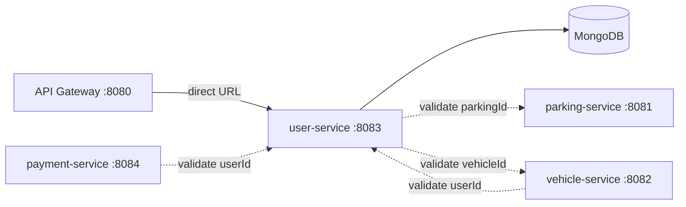

# user-service

The only **Node.js (TypeScript/Express)** service in the system. It owns the **users**: registration, authentication, profiles and booking history. Credentials live here — passwords are hashed with **bcrypt** — which makes this service the source of truth the API Gateway asks about on login.

## Role in the system



- Receives its main traffic via the gateway (`/api/user/**` → `/user/**`), but is reached by **direct URL** (the gateway, vehicle-service and payment-service call `http://localhost:8083` directly) because it never registers with Eureka.
- **Is consumed by** vehicle-service (vehicle registration validates the `userId`), payment-service (payment creation validates the `userId`) and the API Gateway (`/user/login` when issuing JWTs).
- **Consumes** parking-service and vehicle-service to validate the ids recorded in a user's booking history.

## Tech stack

| Layer | Choice |
| --- | --- |
| Runtime | Node.js + TypeScript |
| Web framework | Express 5 |
| Database | MongoDB via Mongoose |
| Validation | Zod schemas |
| Auth | `bcryptjs` (password hashing) + `jsonwebtoken` (Node-issued JWT) |
| Outbound calls | `axios` |

## Project structure

```
services/user-service/
├── Dockerfile / .dockerignore      # node:latest build → node:latest runtime
├── package.json                    # typescript, tsx for dev, tsc for typecheck
├── .env                            # PORT, MONGO_URI, PARKING_SERVICE_URL, VEHICLE_SERVICE_URL
└── src/
    ├── index.ts                    # entry point: loads remote config, then starts the server
    ├── app.ts                      # Express app: cors, json body, routes, error handling
    ├── config/
    │   └── remoteConfig.ts         # fetches config-repo/user-service.yaml from the config server
    ├── controllers/
    │   └── user.controller.ts      # thin handlers → service, wraps in success envelope
    ├── errors/
    │   └── custom.errors.ts        # error classes carrying an HTTP statusCode
    ├── middlewares/
    │   ├── error.middleware.ts     # notFoundHandler + central error → JSON response
    │   └── validate.middleware.ts  # Zod validation middleware for body/params/query
    ├── models/
    │   └── user.model.ts           # Mongoose schemas: User + booking log
    ├── routes/
    │   └── user.routes.ts          # all /user routes wired to controllers + schemas
    ├── schemas/
    │   └── user.schemas.ts         # Zod schemas per operation
    ├── services/
    │   ├── serviceClients.ts       # validateParkingExists / validateVehicleExists (axios)
    │   └── user.service.ts         # all business logic
    └── utils/
        ├── apiResponse.ts          # successResponse(res, statusCode, message, data)
        ├── asyncHandler.ts         # wraps async handlers so errors reach the error middleware
        └── jwt.ts                  # signToken(userId) — Node-issued JWT, 1d expiry
```

### Class-by-class explanation

**`config/remoteConfig.ts`** — the Node counterpart of Spring's config-server import. On boot, `index.ts` awaits it before anything else:

- GETs `http://localhost:8888/user-service/default` (the config server).
- For every key found (e.g. `PORT`, `MONGO_URI`, `PARKING_SERVICE_URL`, `VEHICLE_SERVICE_URL`) it sets `process.env[key]` **only if not already set** — local `.env`/shell environment always wins.

**`index.ts`** — `async start()`: `await loadRemoteConfig()` → read `PORT` (default 8083) → `await connectDB(MONGO_URI)` → `app.listen`. This ordering guarantees the service never boots with default ports/databases when a config server is available.

**`models/user.model.ts`** — two schemas:

- `bookingLogSchema` — `{ parkingId, vehicleId, action ('RESERVED'|'RELEASED'), timestamp }`, no `_id`.
- `userSchema` — `name`, `email` (**unique**), `phone`, `password` (hashed), `role` (`USER|OWNER|ADMIN`, default `USER`), `status` (`ACTIVE|INACTIVE`, default `ACTIVE`), `bookingHistory` (array of logs), timestamps auto-managed.

**`schemas/user.schemas.ts`** — Zod is the validation boundary: `createUserSchema`, `loginSchema`, `updateUserSchema`, `bookingLogSchema` (parkingId/vehicleId required, action limited to `RESERVED`/`RELEASED`), `userIdSchema` (Mongo hex id: `/^[0-9a-fA-F]{24}$/`). Also exports the inferred TS types (`z.infer`) used by the service — so validation rules and types never drift apart.

**`middlewares/validate.middleware.ts`** — Express middleware that parses `req.body` (and/or params/query) against a schema and replaces it with the **parsed** value; on failure responds `400` with the list of Zod messages.

**`middlewares/error.middleware.ts`** — the single error outlet:

- `ZodError` → `400 Validation Failed` + messages list
- any error with a `statusCode` property (the custom error classes) → that status + message
- Mongo duplicate key (code `11000`) → `409`
- `CastError` → `404 User not found`
- anything else → `500 An unexpected error occurred`

**`errors/custom.errors.ts`** — `UserNotFoundError` (404), `DuplicateUserError` (409), `InvalidCredentialsError` (401), `SiblingNotFoundError` (404), `SiblingServiceUnavailableError` (503). All responses from this service use `{ statusCode, message, data }` — the exact envelope shape the Java services use.

**`services/user.service.ts`** — the logic:

- `register` — duplicate-email check, `bcrypt.hash(password, 10)`, persist, return the user **without the password** (`toUserRes` strips it).
- `login` — find by email, `bcrypt.compare`, otherwise `InvalidCredentialsError` ("Invalid email or password"); success → `{ token: signToken(user.id), user }` (user without password).
- `update` / `delete` — standard, with `UserNotFoundError` on missing rows; update re-hashes the password only when a new one is supplied.
- `getBookings` — returns the booking log array.
- `addBooking` — the cross-service bit: `validateParkingExists(data.parkingId)` and `validateVehicleExists(data.vehicleId)` run **before** the log is pushed, so booking history never references ids that don't exist.

**`services/serviceClients.ts`** — axios with a shared `assertResourceExists` helper: GETs the resource URL; a 4xx response → `SiblingNotFoundError` (404); any other failure (5xx, connection refused, timeout) → `SiblingServiceUnavailableError` (503). Base URLs come from env (`PARKING_SERVICE_URL` / `VEHICLE_SERVICE_URL`, defaults `http://localhost:8081` / `:8082`) — delivered by the config server.

**`utils/jwt.ts`** — `signToken(userId)` → Node JWT with `{ userId }` claim, 1 day expiry, secret from `JWT_SECRET` (default `your-jwt-secret`). *Note: this is the token user-service itself issues. The API Gateway does not validate it — the gateway verifies credentials here and then issues its own jjwt token.*

**`utils/apiResponse.ts` / `utils/asyncHandler.ts`** — envelope writer and the async error catcher (`next(error)` so the error middleware sees everything).

## Endpoints

All under `/user`, wrapped in the `{ statusCode, message, data }` envelope:

| Method | Path | Description |
| --- | --- | --- |
| GET | `/user` | all users (passwords stripped) |
| GET | `/user/:id` | one user (id must match a 24-char hex id) |
| POST | `/user/register` | create user → hashed password, defaults role/status |
| POST | `/user/login` | verify credentials → `{ token, user }` |
| PUT | `/user/:id` | update profile (password re-hashed if changed) |
| DELETE | `/user/:id` | delete |
| GET | `/user/:id/bookings` | the user's booking history |
| POST | `/user/:id/bookings` | append a log — **validates parkingId + vehicleId first** |

## Configuration

`src/config/remoteConfig.ts` pulls `config-repo/user-service.yaml` at boot:

```yaml
PORT: 8083
MONGO_URI: mongodb://localhost:27017/user-service
PARKING_SERVICE_URL: http://localhost:8081   # for booking-history validation
VEHICLE_SERVICE_URL: http://localhost:8082   # for booking-history validation
```

Local `.env` values always win over the remote config. Runtime dependencies: config server (`:8888`), MongoDB, and parking/vehicle-service for `addBooking` validation.

## How to run

```bash
cd services/user-service
npm install
npm run dev          # tsx watch, :8083
npm run typecheck    # tsc --noEmit
# or production build:
npm run build && npm start
```

Docker: `docker build -t spms/user-service . && docker run -p 8083:8083 spms/user-service`.