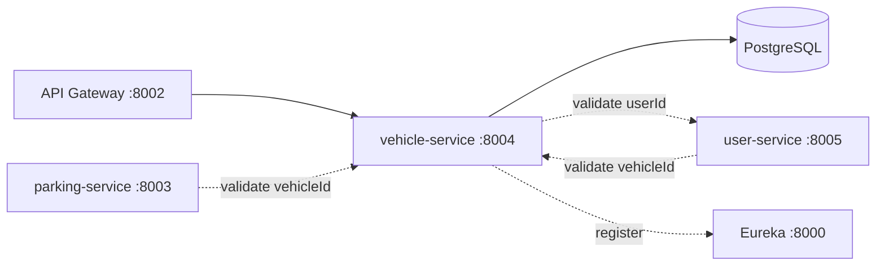

# vehicle-service

Owns the **vehicles** of the system: registration, update, retrieval and the simulated entry/exit tracking that mirrors a vehicle physically entering or leaving the lot.

## Role in the system



- Receives its traffic via the gateway (`/api/vehicle/**` → `/vehicle/**`).
- **Is consumed by** parking-service (reservations must reference a real vehicle) and user-service (booking history validates `vehicleId`s).
- **Consumes** user-service to make sure a vehicle is only registered under a user that actually exists.

## Tech stack

Java 21 · Spring Boot 4.1.0 · Spring Data JPA (Hibernate 7, PostgreSQL) · Bean Validation · ModelMapper · Spring WebFlux WebClient (for the user-service call) · Spring Cloud (config client, Eureka client)

## Project structure

```
services/vehicle-service/
├── Dockerfile / .dockerignore      # same multi-stage pattern as every service
├── pom.xml / mvnw / .mvn/
├── .env                            # local secrets: DB_URL
└── src/main/
    ├── java/com/spms/vehicleservice/
    │   ├── VehicleServiceApplication.java    # boot class, @EnableDiscoveryClient
    │   ├── client/
    │   │   └── UserServiceClient.java        # validates a userId via direct URL to user-service
    │   ├── config/
    │   │   ├── AppConfig.java                # ModelMapper bean
    │   │   └── WebClientConfig.java          # plain (non-load-balanced) WebClient bean
    │   ├── controller/
    │   │   └── VehicleController.java
    │   ├── dto/
    │   │   ├── req/VehicleSaveReq.java       # create body + validation
    │   │   ├── req/VehicleUpdateReq.java     # update body + validation
    │   │   └── res/Vehicle{Summary,Detail,EntryExit}Res.java
    │   ├── entity/
    │   │   ├── Vehicle.java                  # JPA entity, @Version optimistic lock
    │   │   └── VehicleType.java              # CAR, MOTORCYCLE, VAN, TRUCK, BUS
    │   ├── exceptions/                       # domain errors + GlobalExceptionHandler
    │   ├── repo/
    │   │   └── VehicleRepo.java
    │   ├── service/
    │   │   ├── VehicleService.java           # interface
    │   │   └── impl/VehicleServiceImpl.java  # business logic
    │   └── util/
    │       └── ApiResponse.java
    └── resources/
        └── application.yaml                  # app name + config server import
```

### The entity (`entity/Vehicle.java`)

| Field | Type | Notes |
| --- | --- | --- |
| `id` | `Long` | identity-generated primary key |
| `version` | `Long` | `@Version` optimistic lock |
| `userId` | `Long` | owner of the vehicle — validated against user-service on create |
| `vehicleNumber` | `String` | **unique** (repository-level check) — the plate number |
| `vehicleType` | `VehicleType` enum | `CAR`, `MOTORCYCLE`, `VAN`, `TRUCK`, `BUS` |
| `brand`, `model`, `color` | `String` | vehicle details |
| `status` | `VehicleStatus` enum | `INSIDE` / `OUTSIDE`, stored as STRING |
| `createdAt`, `updatedAt` | `LocalDateTime` | `@PrePersist` / `@PreUpdate` callbacks |

### The repository (`repo/VehicleRepo.java`)

```java
Optional<Vehicle> getByVehicleNumber(String vehicleNumber);
boolean existsByVehicleNumber(String vehicleNumber);
List<Vehicle> getAllByUserId(Long userId);
Optional<Vehicle> findByIdForUpdate(Long id);        // SELECT ... FOR UPDATE
```

### The service (`service/impl/VehicleServiceImpl.java`) — the interesting logic

**`save`**:

1. If the request carries a `userId`, `userServiceClient.validateUserExists(userId)` runs first — the vehicle is only registered under a real user. User missing → `404 User not found`; user-service unreachable → `503`. (No userId in the payload = anonymous vehicle, validation skipped.)
2. `existsByVehicleNumber` — duplicate plate numbers are rejected (`VehicleNumberAlreadyExistsException` → 409).
3. ModelMapper copies the DTO to the entity and persists it.

**`registerEntry(vehicleId)` / `registerExit(vehicleId)`** — simulate the vehicle driving in/out:

- Both lock the row with `findByIdForUpdate` inside `@Transactional`.
- Entry: already `INSIDE` → `VehicleAlreadyInsideException` (409); otherwise flip to `INSIDE`.
- Exit: already `OUTSIDE` → `VehicleNotInsideException` (409); otherwise flip to `OUTSIDE`.
- Both return a `VehicleEntryExitRes` built by `buildEntryExitRes` — `{ vehicleId, vehicleNumber, status, timestamp }`.

The `vehicleNumber` and user validations mean the vehicle table never holds dangling references.

### The client (`client/UserServiceClient.java`)

Unlike parking-service's client, this one uses a **plain `WebClient`** (`config/WebClientConfig.java` — no `@LoadBalanced`) because **user-service is a Node app that never registers with Eureka**. The base URL comes from `${user-service.url:http://localhost:8005}` (config-repo). It GETs `/user/{id}`:

- `404` → `UserNotFoundException`
- other error status → `ServiceUnavailableException`
- connection failure → `ServiceUnavailableException`

### Error responses (`exceptions/`)

| Exception → HTTP | When |
| --- | --- |
| `VehicleNotFoundException` → 404 | id / number unknown |
| `UserNotFoundException` → 404 | user-service reported the user is unknown |
| `VehicleNumberAlreadyExistsException` → 409 | duplicate plate number |
| `VehicleAlreadyInsideException` → 409 | entry while already inside |
| `VehicleNotInsideException` → 409 | exit while already outside |
| `ServiceUnavailableException` → 503 | user-service down |
| Bean Validation → 400 | payload rules violated |

## Endpoints

All under `/vehicle`, wrapped in the `ApiResponse` envelope:

| Method | Path | Description |
| --- | --- | --- |
| GET | `/vehicle` | all vehicles |
| GET | `/vehicle/user/{userId}` | vehicles belonging to a user |
| GET | `/vehicle/number/{vehicleNumber}` | lookup by plate number |
| GET | `/vehicle/{id}` | one vehicle (this is the endpoint other services use to validate a `vehicleId`) |
| POST | `/vehicle` | register (validates user if provided) |
| PUT | `/vehicle/{id}` | update details + status |
| POST | `/vehicle/{id}/entry` | mark the vehicle as entered |
| POST | `/vehicle/{id}/exit` | mark the vehicle as departed |
| DELETE | `/vehicle/{id}` | delete |

## Configuration

From `config-repo/vehicle-service.yaml` (via the config server):

```yaml
server.port: 8004
spring.datasource.url: ${DB_URL}        # secret, from local .env
eureka.client.enabled: true
user-service.url: http://localhost:8005 # used by UserServiceClient
```

Local `application.yaml` only names the app and imports the config server + local `.env`.

## How to run

```bash
cd services/vehicle-service
# create .env with: DB_URL=jdbc:postgresql://...
./mvnw spring-boot:run        # :8004
```

Runtime dependencies: eureka (`:8000`), config server (`:8001`), and **user-service (`:8005`)** when registering vehicles with a `userId`. Docker: `docker build -t spms/vehicle-service . && docker run -p 8004:8004 spms/vehicle-service`.